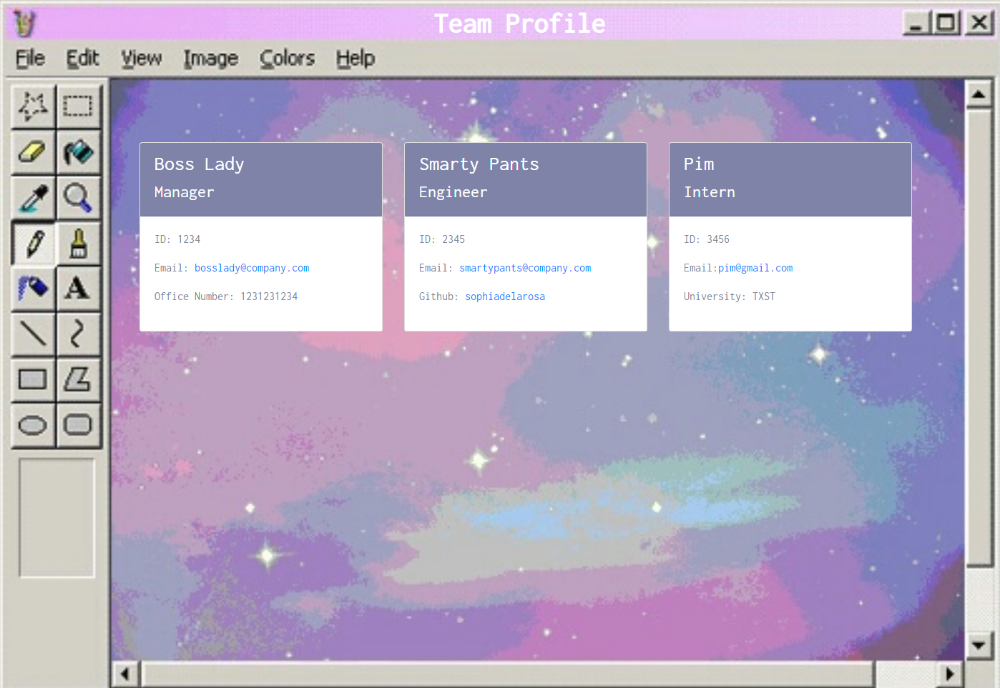

# Team Profile Generator using Object-Oriented Programming

## Description

This is a Node.js command-line application that takes in information about employees on a software engineering team, then generates an HTML webpage that displays summaries for each person. This application uses Jest for testing.

## Mock-Up

The following image shows the generated HTML’s appearance. Please visit this link to see a video demo: https://www.dropbox.com/s/hcjlbvinlwxzm49/teamprofilegeneratordemo.mp4?dl=0

## Installation
Download the files from the GitHub repository and install Node. This application also requires an inquirer module and Jest for testing.

## Usage

The client uses the command line to answer inquirer prompts that generate an HTML page for their team. The user can also run npm test in the command line to make sure each employee role meets requirements for listing their information.

## Contributing

Please see my contact information in the questions section to suggest updates.

## Tests

In the command line, run npm install to download the dev dependencies. Then run npm test to go through a series of tests on the role constructors. 

## Questions

For details, please visit my [github](https://github.com/sophiadelarosa).
For questions, please [email](mailto:${sophial.delarosa@gmail.com}) me.

